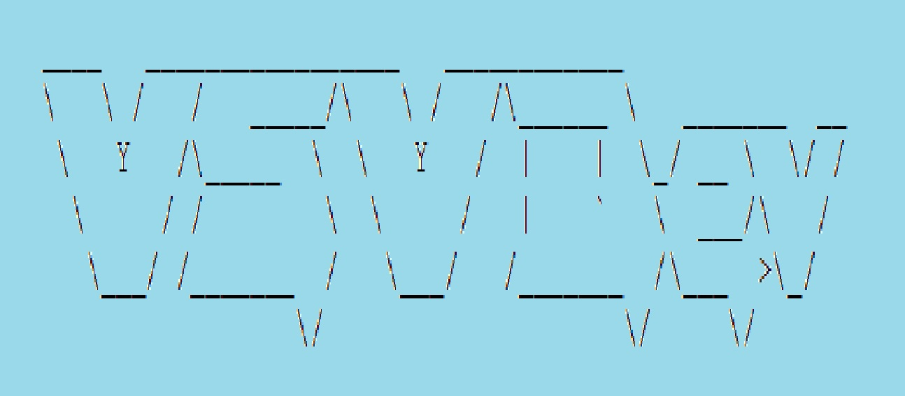

#Multithreading in Java

##**Create Thread** [link to folder](src/com/vsvdev/create)

##**Thread Lifecycle** [link to folder](src/com/vsvdev/threadlife)

##**Atomic** [link to folder](src/com/vsvdev/atomic)

##**Synchronized** [link to folder](src/com/vsvdev/synchro)

##**Volatile** [link to folder](src/com/vsvdev/volatil)

##**CountDownLatch** [link to folder](src/com/vsvdev/countdown)

##**CompletableFuture** [link to folder](src/com/vsvdev/completablefuture)

##**ReentrantLock** [link to folder](src/com/vsvdev/reentrantlock)

##**Condition** [link to folder](src/com/vsvdev/reentrantlock)

##**Singleton** [link to folder](src/com/vsvdev/singleton)

##**CyclicBarrier** [link to folder](src/com/vsvdev/cyclicbar)

##**Semaphore** [link to folder](src/com/vsvdev/semaphore)

##**Executor** [link to folder](src/com/vsvdev/executor)

##**ForkJoinPoll** [link to folder](src/com/vsvdev/forkjoin)

##**Phaser** [link to folder](src/com/vsvdev/phaser)

##**Stream** [link to folder](src/com/vsvdev/stream)

##**Exchanger** [link to folder](src/com/vsvdev/exchanger)

##**Concurrent Collection** [link to folder](src/com/vsvdev/concurrentcollect)
